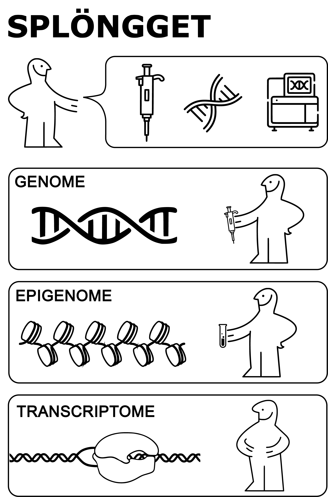

# SPLONGGET analysis

The repository with the code used in SPLONGGET paper.

- For wet lab protocol, check https://dx.doi.org/10.17504/protocols.io.kqdg3wdwpv25/v1  
- For preprocessing pipeline, check https://nf-co.re/scnanoseq/1.0.0/ and https://github.com/IntGenomicsLab/scdnalong.

- Preprint link: https://www.biorxiv.org/content/10.1101/2025.09.08.674950v1